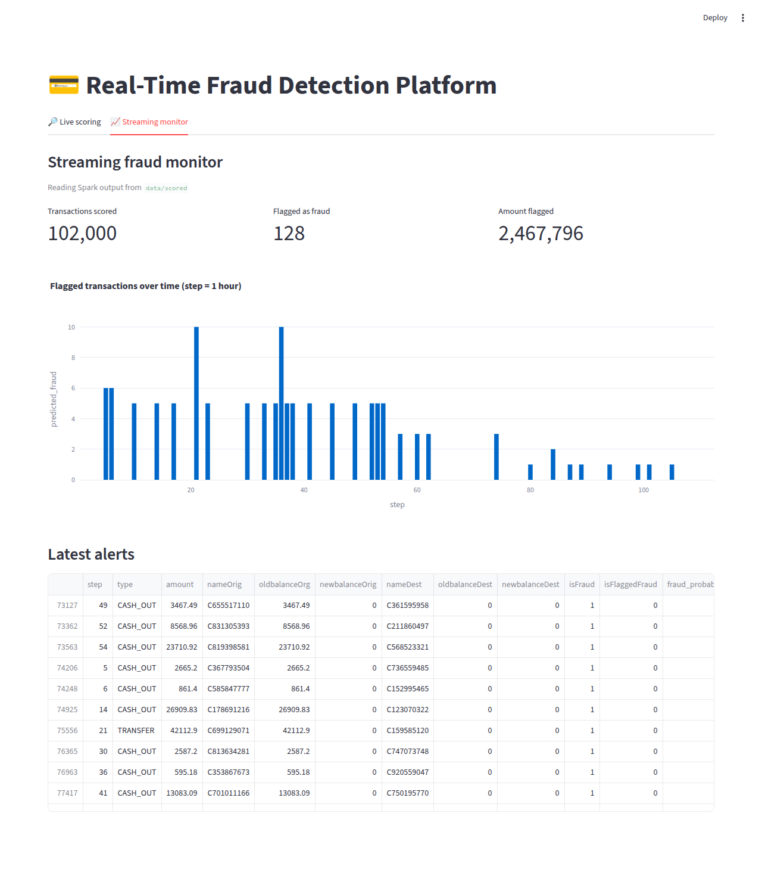

# Real-Time Fraud Detection Platform

An end-to-end, streaming fraud-detection system built on the **PaySim** mobile-money
dataset. Transactions flow through **Kafka → Spark Structured Streaming → an ML model →
a FastAPI scoring service → a live Streamlit dashboard**, mirroring how a bank or fintech
scores card / transfer activity in real time.

## Dashboard (live streaming results)



*The "Streaming monitor" tab reading real Spark output: 102,000 transactions scored,
128 flagged as fraud (0 false positives), fraud volume over time, and the latest alerts.
Regenerate a fresh HTML results report anytime with `make report`.*

```
                 ┌──────────────┐     ┌───────────────────────────┐     ┌─────────────┐
  PaySim CSV ──▶ │ Kafka        │ ──▶ │ Spark Structured Streaming│ ──▶ │ Kafka       │
  (producer)     │ transactions │     │  • parse JSON             │     │ fraud-scores│
                 └──────────────┘     │  • pandas_udf(model)      │     └─────────────┘
                                      │  • threshold → alert      │           │
                                      └───────────┬───────────────┘           ▼
                                                  │                    ┌─────────────┐
                                          parquet ▼  scores            │  Streamlit  │
                                      ┌───────────────────┐            │  dashboard  │
                                      │  data/scored/*.pq │ ─────────▶ │             │
                                      └───────────────────┘            └─────────────┘

  FastAPI scoring service (fraud_platform/serving/app.py)  ── same model, same feature code ──┘
      POST /score   POST /score/batch   GET /health   GET /model   GET /metrics
```

The **same feature-engineering code and the same model wrapper** power both the batch
Spark scorer and the online FastAPI service, so there is zero train/serve skew.

---

## Why PaySim

Real fraud data is confidential, so this uses [PaySim](https://www.kaggle.com/datasets/ealaxi/paysim1)
— a 6.3M-row simulation of mobile-money transactions with labelled fraud. Its key
dynamics (which the model learns) are:

- Fraud occurs **only** in `TRANSFER` and `CASH_OUT` transactions.
- Fraudulent transactions **drain the origin account** (`newbalanceOrig == 0`,
  `amount == oldbalanceOrg`).
- Genuine transactions obey accounting identities; fraud breaks them — captured by the
  `errorBalanceOrig` / `errorBalanceDest` features, the strongest signals in the model.

**No Kaggle account?** No problem. If `data/paysim.csv` is missing, the platform
generates a synthetic dataset with the *same schema and fraud dynamics*, so everything
runs end to end in a fresh clone or in CI.

### Using the real 6.3M-row PaySim dataset

`scripts/download_data.py` pulls the real dataset from Kaggle when credentials are
available, and otherwise falls back to synthetic data. To fetch the real data:

1. Create a Kaggle API token: kaggle.com → *Account* → **Create New API Token**.
   This downloads `kaggle.json`.
2. Provide the credentials either way:
   ```bash
   mkdir -p ~/.kaggle && mv ~/Downloads/kaggle.json ~/.kaggle/ && chmod 600 ~/.kaggle/kaggle.json
   # or:
   export KAGGLE_USERNAME=your_user KAGGLE_KEY=your_key
   ```
3. Download:
   ```bash
   python scripts/download_data.py --kaggle     # real data only; errors if it can't
   python scripts/download_data.py              # real if creds present, else synthetic
   ```

The downloaded CSV is unzipped, its columns validated/normalised
(`fraud_platform/data/validate.py` handles the `oldbalanceOrg` spelling and stray index columns
some mirrors add), and saved to `data/paysim.csv`. Then just `make train` as usual —
the rest of the pipeline is identical.

---

## Requirements

- **Python 3.10+** (CI tests 3.10 / 3.11 / 3.12)
- **Java 8, 11, or 17** — required only for the Spark streaming job. Spark 3.5
  does **not** support Java 18+ (its Arrow integration crashes `pandas_udf`), so
  point `JAVA_HOME` at a JDK 17 if your default is newer:
  ```bash
  export JAVA_HOME=/usr/lib/jvm/java-17-openjdk-amd64
  ```
  The streaming job logs an actionable warning if it detects an unsupported JDK.
- **Docker** — for the local Kafka broker (or bring your own broker).

## Quick start

```bash
# 1. Install (editable, with dev tools)
python -m venv .venv && source .venv/bin/activate
pip install -e ".[dev]"       # or: make install

# 2. Get data (real PaySim via Kaggle if creds present, else synthetic)
make data                     # == python scripts/download_data.py

# 3. Train the model
make train                    # == fraud-train
#   -> models/fraud_model.joblib + models/model_metadata.json

# 4. Serve it
make api                      # http://localhost:8000/docs

# 5. Dashboard (new terminal)
make dashboard                # http://localhost:8501
```

Installing the package also exposes console commands: `fraud-train`,
`fraud-serve`, `fraud-produce`, `fraud-stream`.

Score a transaction directly:

```bash
curl -X POST http://localhost:8000/score -H 'Content-Type: application/json' -d '{
  "type": "TRANSFER", "amount": 181000,
  "oldbalanceOrg": 181000, "newbalanceOrig": 0,
  "oldbalanceDest": 0, "newbalanceDest": 0, "nameDest": "C1666544295"
}'
# -> {"fraud_probability": 0.97, "is_fraud": true, "threshold": 0.5, "scored": true}
```

---

## Running the streaming pipeline

### Easiest: one command, all in Docker (recommended, esp. on Windows)

Runs Kafka **and** the Spark scorer inside Linux containers, so you need only
**Docker Desktop** — no local Java / Spark / `winutils` setup. It produces
transactions, scores them with Spark, and writes results into `data/scored/`,
which the dashboard's "Streaming monitor" tab reads.

```bash
docker compose -f docker-compose.streaming.yml up --build
```

Wait for `=== DONE ... ===`, then start (or refresh) the dashboard and open the
**Streaming monitor** tab:

```bash
streamlit run fraud_platform/dashboard/app.py
```

Stop Kafka when finished: `docker compose -f docker-compose.streaming.yml down`.

### Manual: run each stage yourself (needs local Java 8/11/17)

```bash
# 1. Start Kafka
make kafka-up                # docker compose up -d zookeeper kafka

# 2. Start the Spark scorer (Kafka -> model -> Kafka + parquet)
make stream                  # python -m fraud_platform.streaming.spark_stream
#   process the backlog once and exit: python -m fraud_platform.streaming.spark_stream --available-now
#   quick look without sinks:          python -m fraud_platform.streaming.spark_stream --console

# 3. Replay PaySim as a live feed (throttled to N tx/s)
make producer                # python -m fraud_platform.streaming.producer

# 4. Watch the dashboard's "Streaming monitor" tab fill up
make dashboard
```

Everything (API + dashboard + Kafka) can also run in containers:

```bash
docker compose up --build
```

---

## Project layout

```
pyproject.toml                Packaging, deps, entry points, tool config
config/config.yaml            Central config (env-var overridable)
scripts/                      Data download, HTML report, pipeline runner
fraud_platform/
  config.py                   Config loader with attribute access + env overrides
  logging_config.py           Central logging setup
  data/                       Synthetic PaySim generator + schema validation
  features/engineering.py     Shared feature engineering (train == serve)
  training/train.py           Train + evaluate + persist the model
  serving/
    model.py                  Model load + scoring wrapper (used by API & Spark)
    app.py                    FastAPI scoring service
    schemas.py                Pydantic request/response models
  streaming/
    producer.py               Kafka producer replaying PaySim
    spark_stream.py           Spark Structured Streaming scorer (pandas_udf)
  dashboard/app.py            Streamlit dashboard
tests/                        pytest suite (features, data, training, API, config)
docs/architecture.md          Architecture & design decisions
docker-compose.yml            Kafka + API + dashboard
docker-compose.streaming.yml  One-command Kafka + Spark streaming pipeline
Dockerfile                    App image (Python + JRE for PySpark)
.github/workflows/ci.yml      CI: ruff + black + pytest (Py 3.10–3.12)
```

---

## Model & features

The model (default: `RandomForestClassifier` with balanced class weights; also
`xgboost` — with `scale_pos_weight` for the class imbalance — plus
`gradient_boosting` / `logistic`, selectable via `fraud-train --algorithm`) is
trained only on the fraud-eligible `TRANSFER` / `CASH_OUT` transactions.
Engineered features:

| Feature | Meaning |
|---|---|
| `amount` | Transaction amount |
| `oldbalanceOrg`, `newbalanceOrig` | Origin balance before / after |
| `oldbalanceDest`, `newbalanceDest` | Destination balance before / after |
| `errorBalanceOrig` | `newbalanceOrig + amount − oldbalanceOrg` (0 when consistent) |
| `errorBalanceDest` | `oldbalanceDest + amount − newbalanceDest` |
| `amount_to_oldOrg` | Amount relative to origin balance |
| `orig_zeroed_out` | Origin account fully drained |
| `dest_is_merchant` | Destination is a merchant (`M…`) account |
| `type_TRANSFER`, `type_CASH_OUT` | Transaction-type one-hots |

Training logs and stores (in `models/model_metadata.json`) ROC-AUC, PR-AUC, fraud
precision/recall/F1, the confusion matrix, and feature importances.

---

## Exploratory analysis

`notebooks/eda.ipynb` explores the PaySim fraud signal (class imbalance,
fraud-by-type, amount distributions, the balance-error separation, and the
account-drained signature). It renders with charts on GitHub, and re-runs on the
real dataset when `data/paysim.csv` is present:

```bash
jupyter nbconvert --to notebook --execute --inplace notebooks/eda.ipynb
```

## Testing

```bash
make test        # or: pytest
```

The suite trains a small model on synthetic data and exercises the feature layer, the
model wrapper, and the FastAPI endpoints via `TestClient` — no Kafka or Spark required,
so it runs anywhere (and in CI on every push).

---

## Configuration

Everything is driven by `config/config.yaml`, with env-var overrides for deployment
(see `.env.example`): `KAFKA_BOOTSTRAP_SERVERS`, `MODEL_PATH`, `SERVING_PORT`,
`DASHBOARD_API_URL`, `KAFKA_INPUT_TOPIC`, `KAFKA_OUTPUT_TOPIC`, and more.
